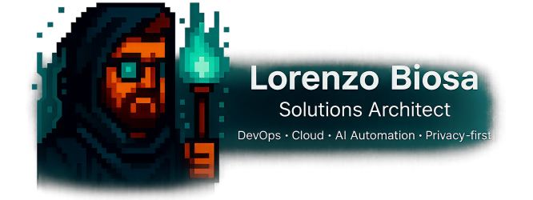

---

---

## 🚀 About Me

I'm a **Cloud & Infrastructure Architect**, focused on designing and leading **secure**, **scalable**, and **enterprise-grade platforms** across **hybrid and multi-cloud environments**.

With over a decade of experience in **mission-critical systems**, I work at the intersection of **cloud strategy**, **platform engineering**, **automation**, and **agentic AI**, helping organizations evolve toward **cloud-native and AI-enabled operating models** with a strong **security- and privacy-first** approach.

I specialize in:

- 🏗 **Cloud Platforms & IaC**: Terraform, Bicep, Kubernetes, OpenShift, ArgoCD
- 🔒 **Security by Design**: Policy-as-Code (OPA / Conftest), SBOM, secrets management
- 🤖 **Agentic AI & Automation**: AI agents, intelligent workflows, ChatOps, automation-driven operations
- ☁️ **Hybrid & Multi-Cloud Architecture**: Azure, AWS, landing zones, governance, enterprise-scale foundations

---

## 💡 Key Highlights

I help organizations **modernize large-scale and mission-critical environments**, guiding end-to-end transformation journeys that combine **cloud-native platforms**, **automation**, and **agentic AI systems**.

My focus is on translating **architectural complexity** into **resilient, secure, and future-ready operating models** that align technology decisions with long-term business outcomes.

---

## 📌 Featured Projects

> These repositories represent the core of my work and personal R&D.

- **[chat-ui](https://github.com/lorenzobiosa/chat-ui)**  
  Modern **SPA webchat** built with **React / Next.js**, enabling **secure real-time communication** via API, WebSocket, and SSE. Designed for **enterprise-scale**, supporting **AI-driven conversations** and **bot orchestration** with responsive UX.

- **[chat-backend](https://github.com/lorenzobiosa/chat-backend)**  
  _Conversation-centric API_ built with **NestJS**. Exposes REST `v1/conversations` with nested `messages` (**CRUD & streaming**). Supports **WebSocket/SSE**, **OAuth2/JWT**, _idempotent creates_, **pagination**, and full **OpenAPI docs**. Features **modular persistence** (_ephemeral, local, remote_).

- **[ai-orchestrator-agent](https://github.com/lorenzobiosa/ai-orchestrator-agent)**  
  LangGraph-based orchestrator for **multi-agent / agentic AI workflows**. Routes requests via **A2A protocol**, integrates **LLMs**, **RAG**, and external tools, leveraging a dedicated **RAG service**. Built for **interoperability**, **security**, and **extensibility**.

- **[ai-specialist-agent](https://github.com/lorenzobiosa/ai-specialist-agent)**  
  Domain-specific **agentic AI** for _secure, context-aware automation_. Integrates with **LLMs**, dynamically assigns **tools**, and executes specialized actions via the **MCP protocol**.

- **[mcp-tools-library](https://github.com/lorenzobiosa/mcp-tools-library)**  
  Modular library of **MCP tools** enabling advanced actions such as **SSH**, **database operations**, and **API integrations** for **enterprise AI workflows**. Designed for seamless integration with **orchestrator** and **specialist agents**.

- **[container-toolkit](https://github.com/lorenzobiosa/container-toolkit)**  
  **Secure**, multi-platform troubleshooting container based on **Red Hat UBI**. Includes essential tools for **Docker**, **Podman**, **Kubernetes**, **OpenShift**, and **Rancher**. Runs **rootless** and supports **Helm-based deployments**.

- **[storage-sync-engine](https://github.com/lorenzobiosa/storage-sync-engine)**  
  **High-performance**, **multithreaded** engine for continuous storage synchronization during cloud migrations. Supports **initial sync**, **live change tracking**, multiple paths, and secure **bastion execution**.

- **[excel-to-terraform](https://github.com/lorenzobiosa/excel-to-terraform)**  
  Accelerates **cloud migrations** by converting human-readable **Excel sheets** into **Terraform manifests**, enabling fast and error-free deployments. Currently supports **Azure**, with plans for **multi-cloud expansion**.

---

## 🛠 Technologies I Use

<!-- Languages -->

<!-- Backend / Frontend -->

<!-- AI / Agentic -->

<!-- Cloud / DevOps -->

<!-- Cloud Providers -->

<!-- Infra / Ops -->

<!-- Security -->

---

## 🔧 My Principles

- **Privacy-first** and **Security-by-Design** across platforms and data flows
- **Automation over manual operations** using IaC, pipelines, and policy enforcement
- **Observability & reliability** through metrics, tracing, and actionable SLOs

---

## 📊 GitHub Stats

  

---

## 📱 Connect with Me

- **[LinkedIn](https://www.linkedin.com/in/lorenzobiosa)**
- **[GitHub](https://github.com/lorenzobiosa)**
- **[X / Twitter](https://x.com/lorenzobiosa)**
- **[Patreon](https://patreon.com/lorenzobiosa)**

🌐 **Website**: _(coming soon)_

---

## 💖 Support My Work

If you find my work valuable, consider supporting it:

- **[GitHub Sponsors](https://github.com/sponsors/lorenzobiosa)**
- **[Patreon](https://patreon.com/lorenzobiosa)**

---

## ✅ Notes

- All commits are **GPG-signed** (`Verified`)
- This profile README lives in `lorenzobiosa/lorenzobiosa`

---

## 🧑‍💻 Let’s Build Something Great Together

Always open to collaborations and technical discussions around **cloud architecture**, **DevOps**, and **agentic AI systems**.  
If you're building **secure, scalable, and intelligent platforms**, feel free to reach out.

---
